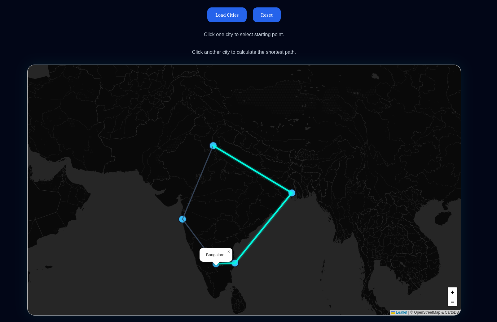

# 🌍 GeoPath-AI

An intelligent AI-powered navigation and route optimization system built to redefine smart travel, emergency response, and location intelligence.

GeoPath-AI combines modern mapping technologies, AI-assisted routing, and real-time navigation concepts into a futuristic navigation ecosystem.

---

## 🚀 Features

- 🧠 AI-Based Route Suggestions
- 📍 Real-Time Navigation System
- 🛰️ Smart Location Tracking
- 🛣️ Dynamic Path Optimization
- 🚨 Emergency Route Assistance
- 🎙️ Voice Navigation Support
- 🌐 Interactive Map Integration
- 📱 Responsive Modern UI

---

## 🛠️ Tech Stack

### Frontend
- HTML5
- CSS3
- JavaScript

### Backend / Logic
- Python
- Flask

### APIs & Tools
- Google Maps API
- OpenStreetMap
- Geolocation API

---

## 📸 Project Preview

<p align="center">
  
</p>

---

## ⚡ Installation

```bash
git clone https://github.com/yoshinoGrg/GeoPath-AI.git

cd GeoPath-AI
